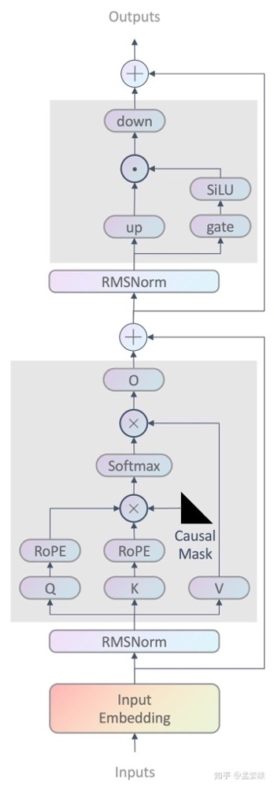
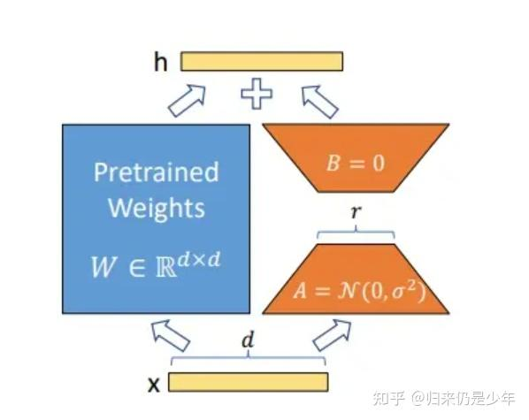

## 常见llama，mixtral，qwen，chatglm的内部架构以及之间的区别

昨天这幅图是经典的decoder架构图，后面只会说这基础之上的改动。
1. **Llama系列**：
    同上图 只是要注意GQA的问题
2. **qwen系列**：
    qwen1的self attention的qkv矩阵共享权重 例如self.c_attn = nn.Linear(config.hidden_size, 3 * self.projection_size)
   qwen2的self attention不共享权重改回来了 但是qkv矩阵的bias都是True，o是False MLP矩阵的bias是False。传统的一般都是False
3. **mistral系列**：
    全加了GQA的llama
4. **chatglm系列**：
    不太喜欢glm喜欢搞些奇奇怪怪的，之前经常跑bug出来。
    glm2、3、4的MLP的实现不太一样，他的gate_proj和up_proj是共享参数的，其他的没太大区别。Self attention层的qkv也是共享参数的。
    glm2之后都是纯decoder的，之前是prefix架构。
## GPT系列的区别
GPT系列
GPT 1以多层 transformer decoder 堆叠的方式构成了整个预训练模型结构。最早一批提出在 NLP 任务上使用 pre-train + fine-tuning 范式的工作。

GPT-2 主要想解决 zero-shot问题，在迁移到其他任务上的时候不需要额外的标注数据，也不需要额外的模型训练。

GPT-2 进行上述模型调整的主要原因在于，随着模型层数不断增加，梯度消失和梯度爆炸的风险越来越大，这些调整能够减少预训练过程中各层之间的方差变化，使梯度更加稳定。

GPT-2模型结构创新:
1.	post-norm改pre-norm. 两者的主要区别在于，post-norm 将 transformer 中每一个 block 的层归一化放在了残差层之后，而 pre-norm 将层归一化放在了每个 block 的输入位置
2.	在模型最后一个自注意力层之后，额外增加一个层归一化
3.	调整参数的初始化方式，按残差层个数进行缩放，缩放比例为 1 :根号n
4.	输入序列的最大长度从 512 扩充到 1024

GPT-3 延续使用 GPT 模型结构，但是引入了 Sparse Transformer 中的 sparse attention 模块（稀疏注意力）。
dense attention：每个 token 之间两两计算 attention，复杂度 O(n²)
sparse attention：每个 token 只与其他 token 的一个子集计算 attention，复杂度 O(n*logn)

区别GPT2：

1. 效果上，超出 GPT-2 非常多，能生成人类难以区分的新闻文章；
2. 主推 few-shot，相比于 GPT-2 的 zero-shot，具有很强的创新性；
3. 模型结构略微变化，采用 sparse attention 模块；
4. 海量训练语料 45TB（清洗后 570GB），相比于 GPT-2 的 40GB；
5. 海量模型参数，最大模型为 1750 亿，GPT-2 最大为 15 亿参数；

## prefix LM和causal LM之间有什么区别
Prefix LM（前缀语言模型）和Causal LM（因果语言模型）是两种不同类型的语言模型，它们在架构和应用场景上有一些区别。

1. **Causal LM（因果语言模型）**
- **定义**：Causal LM是一种单向语言模型，它在生成序列时，每个位置的输出只依赖于当前位置之前的词。换句话说，模型在预测当前词时只能看到它左边的词，而不能看到它右边的词。
- **应用**：常用于文本生成任务，如GPT系列模型。它们按照从左到右的顺序逐词生成文本，确保生成的每个词只依赖于之前生成的内容，遵循因果顺序。
- **架构特点**：
    - 使用标准的自注意力机制，但在生成过程中使用掩码（masking）来确保每个位置只关注前面的词。
    - 适合生成式任务，如写作、聊天机器人等。

2. **Prefix LM（前缀语言模型）**
- **定义**：Prefix LM是一种扩展的语言模型，它的输入由一个固定的前缀部分和一个需要生成的部分组成。模型会使用整个前缀部分来预测接下来的词。这种模型在生成时，前缀部分的词可以彼此互相依赖，但生成部分的词仍然遵循因果顺序。
- **应用**：常用于对话系统、条件文本生成等场景。在这些场景中，前缀部分可以是用户提供的上下文或命令，模型根据这个前缀生成符合上下文的文本。
- **架构特点**：
    - 前缀部分可以使用完整的自注意力机制，允许它们互相影响。
    - 生成部分的词只能依赖于前缀和之前生成的词，类似于Causal LM的行为。
    - 适用于条件生成任务，如摘要生成、对话生成等。

3. **主要区别**
- **上下文依赖性**：
    - **Causal LM**：严格遵循从左到右的顺序，生成当前词时只能依赖前面的词。
    - **Prefix LM**：前缀部分可以自由依赖，并且模型可以利用整个前缀信息来生成后续的词。

- **灵活性**：
    - **Causal LM**：适用于无条件的生成任务或必须严格按照时间顺序进行预测的任务。
    - **Prefix LM**：更加灵活，适用于需要条件信息的生成任务，可以利用前缀提供的上下文进行更有针对性的文本生成。

- **应用场景**：
    - **Causal LM**：文本生成、开放域对话、续写任务。
    - **Prefix LM**：条件生成、特定上下文下的对话系统、定制内容生成。

Causal LM是严格单向的，适用于没有上下文依赖的生成任务，而Prefix LM则允许利用一个前缀上下文，适用于需要条件输入的生成任务。
其实简单来说给一个prompt，输出是token1 token2 token3.Causal LM生成token2的时候只能看到token1，Prefix LM能看到prompt + token1

## LoRA和Ptuning V2
LoRA（Low-Rank Adaptation）和P-tuning v2是两种用于微调大型预训练语言模型的方法，它们通过不同的方式在保持模型性能的同时减少了计算成本和存储需求。

1. **LoRA（Low-Rank Adaptation）**

**概念**：
LoRA是一种低秩矩阵适配方法，旨在通过向模型插入低秩矩阵的形式来微调模型，从而降低参数量和计算复杂度。LoRA的核心思想是将模型中的部分权重矩阵分解为两个较小的矩阵，通过这两个低秩矩阵的调整来实现模型的微调，而不是直接调整原始的大型权重矩阵。

**工作原理**：
- 在微调过程中，LoRA不会直接更新模型的所有权重矩阵，而是将某些权重矩阵（通常是Transformer层中的投影矩阵）分解为两个低秩矩阵`A`和`B`。
- 通过这种低秩分解，可以在不改变原始模型架构的情况下，通过调整`A`和`B`矩阵来适应特定任务。
- 这不仅减少了需要调整的参数数量，还能显著降低微调的计算开销。
2. **P-tuning v2**

**概念**：
P-tuning v2是Prompt Tuning的增强版本，主要用于微调预训练语言模型。它通过在输入层添加可学习的嵌入层（prompt tokens）来影响模型的输出。这种方法尤其适合在下游任务中通过少量数据进行微调。

**工作原理**：
- P-tuning v2在原始输入序列前插入一组可学习的prompt tokens，这些tokens在微调过程中会被优化。
- 与传统的Prompt Tuning不同，P-tuning v2不仅仅是对输入层进行调整，它扩展了这种方法，使得prompt tokens可以插入模型的多层网络中，而不仅限于输入层。
- 这种多层优化策略使得模型能够在不同层级上更深地理解和适应新的任务。

说白了Ptuning或者Prefix tuning就是将tokens -> PrefixEncoder + MLP或者MLP+LSTM作为virtual token放在每层的（embedding）层的前面。

    