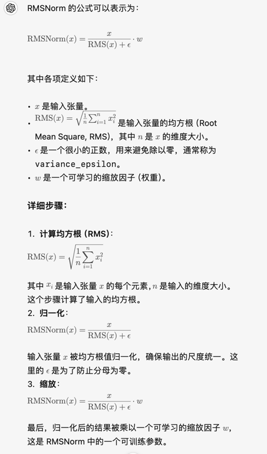

### MHA&GQA版本实现
class Qwen2Attention(nn.Module):
"""
Multi-headed attention from 'Attention Is All You Need' paper. Modified to use sliding window attention: Longformer
and "Generating Long Sequences with Sparse Transformers".
"""

    def __init__(self, config):
        super().__init__()
        self.config = config

        self.hidden_size = config.hidden_size
        self.num_heads = config.num_attention_heads
        self.head_dim = self.hidden_size // self.num_heads
        self.num_key_value_heads = config.num_key_value_heads
        self.num_key_value_groups = self.num_heads // self.num_key_value_heads

        self.q_proj = nn.Linear(self.hidden_size, self.num_heads * self.head_dim, bias=True)
        self.k_proj = nn.Linear(self.hidden_size, self.num_key_value_heads * self.head_dim, bias=True)
        self.v_proj = nn.Linear(self.hidden_size, self.num_key_value_heads * self.head_dim, bias=True)
        self.o_proj = nn.Linear(self.num_heads * self.head_dim, self.hidden_size, bias=False)


    def forward(
        self,
        hidden_states: torch.Tensor,
        attention_mask: Optional[torch.Tensor] = None,
        output_attentions: bool = False,
    ) -> Tuple[torch.Tensor]:
        bsz, q_len, _ = hidden_states.size()

        query_states = self.q_proj(hidden_states)
        key_states = self.k_proj(hidden_states)
        value_states = self.v_proj(hidden_states)

        query_states = query_states.view(bsz, q_len, self.num_heads, self.head_dim).transpose(1, 2)
        key_states = key_states.view(bsz, q_len, self.num_key_value_heads, self.head_dim).transpose(1, 2)
        value_states = value_states.view(bsz, q_len, self.num_key_value_heads, self.head_dim).transpose(1, 2)


        attn_weights = torch.matmul(query_states, key_states.transpose(2, 3)) / math.sqrt(self.head_dim)


        if attention_mask is not None:  # no matter the length, we just slice it
            attn_weights = attn_weights + attention_mask

        # upcast attention to fp32
        attn_weights = nn.functional.softmax(attn_weights, dim=-1, dtype=torch.float32).to(query_states.dtype)
        attn_output = torch.matmul(attn_weights, value_states)

        attn_output = attn_output.transpose(1, 2).contiguous()
        attn_output = attn_output.reshape(bsz, q_len, self.hidden_size)

        attn_output = self.o_proj(attn_output)
        return attn_output


```
class Qwen2RMSNorm(nn.Module):
    def __init__(self, hidden_size, eps=1e-6):
    
      super().__init__()
      self.weight = nn.Parameter(torch.ones(hidden_size))
      self.variance_epsilon = eps

    def forward(self, hidden_states):
        input_dtype = hidden_states.dtype
        hidden_states = hidden_states.to(torch.float32)
        variance = hidden_states.pow(2).mean(-1, keepdim=True)
        hidden_states = hidden_states * torch.rsqrt(variance + self.variance_epsilon)
        return self.weight * hidden_states.to(input_dtype)
```
### 总结：
RMSNorm 通过均方根（RMS）来对输入张量进行归一化，并且具有一个可学习的缩放参数 \( w \)。这种归一化方法避免了对均值的计算，通常能加快计算速度并增强数值稳定性。


### 手写RoPE
```
class Qwen2RotaryEmbedding(nn.Module):
    def __init__(self, dim, max_position_embeddings=2048, base=10000, device=None):
        super().__init__()

        self.dim = dim
        self.max_position_embeddings = max_position_embeddings
        self.base = base
        inv_freq = 1.0 / (self.base ** (torch.arange(0, self.dim, 2, dtype=torch.int64).float().to(device) / self.dim))
        self.register_buffer("inv_freq", inv_freq, persistent=False)

        # Build here to make `torch.jit.trace` work.
        self._set_cos_sin_cache(
            seq_len=max_position_embeddings, device=self.inv_freq.device, dtype=torch.get_default_dtype()
        )

    def _set_cos_sin_cache(self, seq_len, device, dtype):
        self.max_seq_len_cached = seq_len
        t = torch.arange(self.max_seq_len_cached, device=device, dtype=torch.int64).type_as(self.inv_freq)

        freqs = torch.outer(t, self.inv_freq)
        # Different from paper, but it uses a different permutation in order to obtain the same calculation
        emb = torch.cat((freqs, freqs), dim=-1)
        self.register_buffer("cos_cached", emb.cos().to(dtype), persistent=False)
        self.register_buffer("sin_cached", emb.sin().to(dtype), persistent=False)

    def forward(self, x, seq_len=None):
        # x: [bs, num_attention_heads, seq_len, head_size]
        if seq_len > self.max_seq_len_cached:
            self._set_cos_sin_cache(seq_len=seq_len, device=x.device, dtype=x.dtype)

        return (
            self.cos_cached[:seq_len].to(dtype=x.dtype),
            self.sin_cached[:seq_len].to(dtype=x.dtype),
        )
```

### DPO Loss
```
def dpo_loss(
        self,
        policy_chosen_logps: torch.FloatTensor,
        policy_rejected_logps: torch.FloatTensor,
        reference_chosen_logps: torch.FloatTensor,
        reference_rejected_logps: torch.FloatTensor,
        reference_free: bool = False,
    ) -> Tuple[torch.FloatTensor, torch.FloatTensor, torch.FloatTensor]:
        """Compute the DPO loss for a batch of policy and reference model log probabilities.

        Args:
            policy_chosen_logps: Log probabilities of the policy model for the chosen responses. Shape: (batch_size,)
            policy_rejected_logps: Log probabilities of the policy model for the rejected responses. Shape: (batch_size,)
            reference_chosen_logps: Log probabilities of the reference model for the chosen responses. Shape: (batch_size,)
            reference_rejected_logps: Log probabilities of the reference model for the rejected responses. Shape: (batch_size,)
            beta: Temperature parameter for the DPO loss, typically something in the range of 0.1 to 0.5. We ignore the reference model as beta -> 0.
            reference_free: If True, we ignore the _provided_ reference model and implicitly use a reference model that assigns equal probability to all responses.

        Returns:
            A tuple of three tensors: (losses, chosen_rewards, rejected_rewards).
            The losses tensor contains the DPO loss for each example in the batch.
            The chosen_rewards and rejected_rewards tensors contain the rewards for the chosen and rejected responses, respectively.
        """
        pi_logratios = policy_chosen_logps - policy_rejected_logps
        ref_logratios = reference_chosen_logps - reference_rejected_logps

        if reference_free:
            ref_logratios = 0

        logits = pi_logratios - ref_logratios

        losses = -F.logsigmoid(self.beta * logits)
        chosen_rewards = self.beta * (policy_chosen_logps - reference_chosen_logps).detach()
        rejected_rewards = self.beta * (policy_rejected_logps - reference_rejected_logps).detach()

        return losses, chosen_rewards, rejected_rewards
```

### 一个算法题，给定一个数字比如8，找到所有因式相乘组合，例如222 24 42 8 （搜刮下来的来自文心
```
def find_factors(n):
    def backtrack(start, target, path, result):
        if target == 1 and path:
            result.append(path)
            return
        for i in range(start, n + 1):
            if target % i == 0:
                backtrack(i, target // i, path + [i], result)

    result = []
    backtrack(2, n, [], result)
    return result

n = 8
factor_combinations = find_factors(n)
print(factor_combinations)
```
### 给定数n(偶数)，可以形成两行n//2列的数组a，要求对于任意列都有a[0][j] < a[1][j]，找到所有可能
要找到给定偶数 `n`，可以形成两行 `n//2` 列的所有可能数组 `a`，并且满足对于任意列都有 `a[0][j] < a[1][j]` 的条件，可以通过生成组合的方法来实现。以下是Python代码示例：

```python
import itertools

def find_all_possible_arrays(n):
    # n 必须是偶数
    if n % 2 != 0:
        raise ValueError("n must be an even number")

    # 生成所有从 1 到 n 的数
    numbers = list(range(1, n + 1))

    # 找到所有可能的两行分配方式
    possible_arrays = []
    
    # 找到长度为 n//2 的所有组合
    for comb in itertools.combinations(numbers, n//2):
        row1 = list(comb)
        row2 = [x for x in numbers if x not in row1]
        
        # 检查是否满足每列的 a[0][j] < a[1][j]
        if all(row1[j] < row2[j] for j in range(n//2)):
            possible_arrays.append((row1, row2))
    
    return possible_arrays

n = 6  # 例如 n = 6
possible_arrays = find_all_possible_arrays(n)
for row1, row2 in possible_arrays:
    print("Row 1:", row1)
    print("Row 2:", row2)
    print()
```

### 说明：
- 首先，`numbers` 生成了从 1 到 `n` 的数字列表。
- 使用 `itertools.combinations` 找出所有可能的两行 `n//2` 列的分配方式。
- 对于每一种组合，检查是否满足条件 `a[0][j] < a[1][j]`。如果满足，则将组合加入 `possible_arrays` 列表。
- 最终，代码会输出所有满足条件的数组组合。

### 示例输出：
对于 `n = 6`，可能的数组组合有：

```
Row 1: [1, 2, 3]
Row 2: [4, 5, 6]

Row 1: [1, 2, 4]
Row 2: [3, 5, 6]

Row 1: [1, 3, 4]
Row 2: [2, 5, 6]

Row 1: [2, 3, 4]
Row 2: [1, 5, 6]
```

### rand7到rand10
```
import random

def rand7():
    return random.randint(1, 7)

def rand10():
    while True:
        a = rand7()
        b = rand7()
        index = (a - 1) * 7 + b  # 生成 1 到 49 的数字
        if index <= 40:  # 只使用 1 到 40 的结果
            return index % 10 + 1  # 映射到 1 到 10

# 测试 rand10() 函数
results = [rand10() for _ in range(10000)]
print(results)
```
### 快排
```
def quicksort(arr):
    # 基本情况：如果数组为空或只有一个元素，直接返回
    if len(arr) <= 1:
        return arr
    else:
        # 选择一个基准值
        pivot_index = random.randint(0,len(nums)-1)
        pivot = arr[pivot_index]
        # 分别找到比基准值小、等于基准值和大于基准值的元素
        left = [x for x in arr if x < pivot]
        middle = [x for x in arr if x == pivot]
        right = [x for x in arr if x > pivot]
        # 递归地对左侧和右侧的数组进行排序，并合并结果
        return quicksort(left) + middle + quicksort(right)

# 测试
arr = [3, 6, 8, 10, 1, 2, 1]
sorted_arr = quicksort(arr)
print(sorted_arr)
```