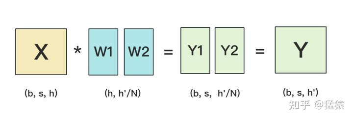

## 训练过程中的显存占用

训练大模型时，显存占用包括以下四个部分：

1. **模型参数占用：**  
   模型权重所占用的内存。

2. **梯度占用：**  
   在反向传播过程中用于存储梯度的内存。

3. **优化器占用：**  
   优化器所需维护的变量所占用的内存。

4. **激活值占用：**  
   激活值所占用的内存，与batch size和序列长度有关。

### 大模型训练中值得注意的两点

1. **混合精度训练：**  
   一般训练使用混合精度训练，即模型权重采用`fp16`（16位浮点数）存储，但在反向传播更新时，混合精度的优化器会维持`fp32`（32位浮点数）的模型权重以及优化器参数的副本，以确保计算的准确性。

2. **优化器状态：**  
   通常LLM训练使用AdamW优化器，它需要维护以下内容：
    - 一份`fp32`的模型权重（4字节 × 7B = 28GB）。
    - 梯度的移动平均值(m)和梯度平方的移动平均值(v)，这两者都是`fp32`存储，因此需要2 × (4字节 × 7B = 28GB)，共56GB。

### 内存占用的计算

1. **模型参数：**  
   `fp16`存储，2字节 × 7B = 14GB。

2. **梯度：**  
   `fp16`存储，2字节 × 7B = 14GB。

3. **激活值：**  
   与batch size和序列长度有关的内存占用。

4. **优化器状态：**
    - `fp32`模型参数：4字节 × 7B = 28GB。
    - `fp32`梯度的移动平均值(m)：4字节 × 7B = 28GB。
    - `fp32`梯度平方的移动平均值(v)：4字节 × 7B = 28GB。

### 总内存占用

因此，如果不考虑训练过程中的激活值，训练过程中总的显存占用是：

- 14GB (`fp16` 模型参数)
- 14GB (`fp16` 梯度)
- 28GB (`fp32` 模型参数)
- 28GB (`fp32` 梯度的移动平均值)
- 28GB (`fp32` 梯度平方的移动平均值)

总计：**112GB**

简单计算下，`fp16`模型参数14GB的内存占用是总内存占用的8倍。

### DeepSpeed的三个阶段
- ZeRO 0:DDP
- ZeRO 1:切分优化器状态
- ZeRO 2:切分优化器状态 + 切分梯度状态
- ZeRO 3:切分优化器状态 + 切分梯度状态 + 切分模型参数
- CPU Offload:ZeRo 2以上可用，将模型参数或者优化器状态放到CPU和NVMe内存。

### 大模型并行策略介绍 DP TP PP

在训练大模型时，通常会采用以下三种并行策略来优化计算资源的使用和提高训练效率：

## 1. 数据并行（Data Parallelism, DP）

数据并行是最常用的并行策略，它的核心思想是将训练数据划分为多个小批次，每个小批次在不同的设备（如GPU）上独立进行前向和后向计算。

- **工作原理：** 每个设备上都有一份完整的模型副本，输入数据被切分成多个批次分发到不同设备进行计算。每次迭代后，各个设备上的梯度会被汇总并平均，然后更新所有设备上的模型参数。
- **优点：** 易于实现，适合小型模型和大规模数据集的训练。
- **缺点：** 在大模型中，模型参数的同步开销较大，尤其在分布式系统中，可能成为性能瓶颈。

```markdown
设备1: 模型副本 + 数据批次1
设备2: 模型副本 + 数据批次2
设备3: 模型副本 + 数据批次3
```

## 2. 张量并行（Tensor Parallelism, TP）

模型并行是指将模型的权重矩阵切分成多个部分，并分别分配到不同的设备上进行计算。

- **工作原理：** 模型的每层网络被切分后，计算过程被分布到多个设备上。这种方式特别适用于超大规模的神经网络模型，其中单个设备无法容纳完整的模型权重。
- **优点：** 可以训练超大模型，不受单个设备显存的限制。
- **缺点：** 层间通信频繁，可能导致计算效率下降，且实现相对复杂。

有两种切法 这里有时候经常问：
- 输入矩阵按列切，模型参数按行切，[图片来源](https://zhuanlan.zhihu.com/p/622212228)
  
- 输入矩阵不切，模型参数按列切
  
  **_MLP层进行TP的时候 AB矩阵的切法是A按列切，B按行切，目的主要是为了减少All reduce产生的通讯开销._**

  **_如果反着来的话，产生的Y1Y2 矩阵间元素会有依赖，每个GPU上的GELU的计算不是完整，需要All reduce，增加了通信开销。_**

  
  
  **_Self Attention层进行TP的时候 QKV矩阵的切法是按列切，MLP层(O层)按行切，目的主要是为了减少All reduce产生的通讯开销，跟MLP一致._**
- MLP、Self-Attention层做forward时产生一次AllReduce，做backward时产生一次AllReduce。AllReduce的过程分为两个阶段，Reduce-Scatter和All-Gather，每个阶段的通讯量都相等。现在我们设每个阶段的通讯量为
x，则一次AllReduce产生的通讯量为2x,**总通讯量为4x**。x=batch_size * seq_length * hidden_size.

这种格式简洁明了，适合快速参考。
```markdown
设备1: 模型的部分权重 + 对应数据部分计算
设备2: 模型的部分权重 + 对应数据部分计算
设备3: 模型的部分权重 + 对应数据部分计算
```

## 3. 流水线并行（Pipeline Parallelism, PP）

流水线并行将模型的不同层分配到不同的设备上，并将数据批次在这些设备之间顺序传递。

- **工作原理：** 模型的不同层分布在不同的设备上，数据按顺序通过这些设备进行前向和后向传播。数据批次可以分批进入模型，从而提高设备利用率。
- **优点：** 减少了显存需求，适用于深度模型的训练，能显著提升设备利用率。
- **缺点：** 需要精心设计流水线阶段和同步机制，否则可能出现设备空闲等待现象，降低效率。

```markdown
设备1: 层1
设备2: 层2
设备3: 层3
```
### 什么是流水线并行中的“bubble”？
在流水线并行中，模型的不同层被分布到不同的设备上。数据按照顺序通过这些设备。由于流水线的分阶段处理，如果某些设备处理速度快于其他设备或者前一阶段的数据尚未准备好，某些设备可能会处于等待状态，这就是“bubble”。

- **缓解方案目前主要是Micro/mini-Batch**  
  它通过将传入的小批次（batch）分块为微批次（micro/mini-batch），并人为创建流水线来解决 GPU 空闲问题，从而允许不同的 GPU 同时参与计算过程，可以显著提升流水线并行设备利用率，减小设备空闲状态的时间。目前业界常见的流水线并行方法 GPipe 和 PipeDream 都采用微批次流水线并行方案。

### 每层通讯开销

- **TP - 张量模型并行：** `8 * b * s * h` （MLP+Self attention）
- **DP - 数据并行：** `16h * h`
- **PP - 流水线并行：** `2 * b * s * h`


