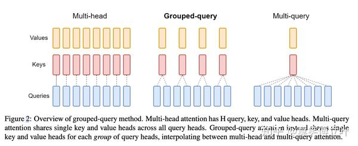

位置编码（Position Encoding）是深度学习模型中，用于表示输入序列中各个元素的位置信息的一种技术。由于Transformer等模型结构中没有内置的顺序信息（不像RNN那样有序地处理序列），位置编码就成为了帮助模型理解序列顺序的关键。

### 1. **为什么需要位置编码**
Transformer模型的核心是自注意力机制，这种机制允许模型在计算时并行处理序列中的所有元素，因此模型本身无法通过其结构直接捕捉到序列的顺序信息。为了让模型理解和利用输入序列的顺序，必须为每个输入元素提供其位置信息，这就是位置编码的作用。

### 2. **位置编码的类型**

#### **a. 绝对位置编码（Absolute Position Encoding）**
每个位置在序列中的绝对位置都有一个唯一的编码，与该位置处的元素一一对应。最常见的绝对位置编码方法是**正弦和余弦函数**，这也是原始Transformer论文中所使用的。

- **公式**：
  对于序列中的位置 \( pos \) 和维度 \( i \)：
  \[
  PE_{(pos, 2i)} = \sin \left(\frac{pos}{10000^{2i/d_{model}}}\right)
  \]
  \[
  PE_{(pos, 2i+1)} = \cos \left(\frac{pos}{10000^{2i/d_{model}}}\right)
  \]
  其中，\( d_{model} \) 是模型的嵌入维度。

- **特点**：
    - **周期性**：正弦和余弦函数的周期性使得模型可以捕捉到序列中的局部和全局模式。
    - **平滑性**：相近位置的编码在数值上也很接近，有助于模型学习到序列中的顺序关系。

#### **b. 相对位置编码（Relative Position Encoding）**
在一些任务中，绝对位置信息可能不如相对位置信息重要。例如，在某些句子或句子对比任务中，元素之间的相对距离更为关键。相对位置编码为每对输入元素的相对位置信息进行编码。

- **应用**：相对位置编码常用于语言模型中，尤其是在处理长序列时，它能帮助模型更好地捕捉到元素之间的相对关系，而不会受到序列长度的过度影响。

- **方法**：一种常见的方法是基于位置差计算编码，直接在自注意力机制中引入相对位置偏移。

#### **c. 可学习的位置编码（Learnable Position Encoding）**
可学习的位置编码不再基于预定义的函数，而是通过训练过程学习到最优的位置信息表示。

- **实现**：可学习的位置编码通常是在序列开始时为每个位置添加一个可学习的向量，然后这些向量会与输入嵌入一起被传递给模型。

- **优点**：允许模型自主学习位置编码的表示，可能更适合某些特定任务。

### 3. **位置编码的作用**
- **顺序建模**：通过位置编码，Transformer模型可以区分不同位置的元素，进而理解序列的顺序。
- **位置感知**：在很多任务中，位置信息是至关重要的，例如在翻译、文本生成等任务中，句子的顺序决定了句子结构和语义。

### 4. **位置编码的局限性**
- **长序列处理**：对于非常长的序列，位置编码（特别是正弦和余弦编码）的效果可能会减弱，模型可能难以准确捕捉到远距离元素之间的关系。
- **固定长度**：在某些模型中，位置编码的长度是固定的，这可能限制了模型处理不同长度序列的灵活性。

Transformer、BERT、以及一些大型语言模型（LLM）在位置编码的选择上有所不同，具体如下：

### 1. **Transformer**
Transformer模型中，位置编码使用的是**绝对位置编码**，并且采用了**正弦和余弦函数**来实现。

- **位置编码类型**：绝对位置编码（Absolute Position Encoding）。
- **实现方式**：正弦和余弦函数。每个位置的编码由正弦和余弦函数生成，公式如前所述。这种编码方式使得模型可以利用序列中的全局和局部模式，并且具备平滑的编码特性。

### 2. **BERT**
BERT模型与原始Transformer类似，也使用了**绝对位置编码**，但它采用了**可学习的位置编码**，而不是固定的正弦和余弦函数。

- **位置编码类型**：绝对位置编码（Absolute Position Encoding）。
- **实现方式**：可学习的位置编码（Learnable Position Encoding）。在BERT中，位置编码是作为可学习的嵌入向量，与词嵌入（Word Embedding）和段落嵌入（Segment Embedding）一起输入到模型中。这些位置嵌入会在训练过程中被调整，以便模型能更好地理解序列的顺序。

### 总结
- **Transformer**（原始）：使用绝对位置编码，基于正弦和余弦函数（固定）。
- **BERT**：使用绝对位置编码，采用可学习的位置嵌入。
- **GPT、T5**）：根据模型不同，GPT系列使用可学习的绝对位置编码，而T5使用相对位置编码。

ROPE（Rotary Position Embedding，旋转位置编码）是一种**相对位置编码**。与传统的绝对位置编码不同，ROPE通过对输入的嵌入向量应用旋转变换，使得模型能够捕捉到相对位置之间的关系。

### 1. **位置编码类型**：
ROPE属于**相对位置编码**（Relative Position Encoding）。

### 2. **工作原理**：
- ROPE通过对输入嵌入向量的奇偶维度分别应用不同的旋转操作，使得在自注意力机制中能够隐式地包含相对位置信息。
- 具体来说，ROPE在对输入序列的每个元素进行编码时，将该元素的位置与旋转矩阵相结合，从而在注意力计算过程中保留了位置信息。这种旋转使得模型能够感知到元素之间的相对距离，而不仅仅是绝对位置。

### 3. **优点**：
- **相对位置感知**：ROPE编码能够有效捕捉序列中元素之间的相对位置信息，这对处理长序列特别有用，因为它能够更自然地表示元素之间的相对顺序关系。
- **计算效率**：与传统的相对位置编码方法相比，ROPE在计算上更为高效，且容易与自注意力机制集成。

Post-norm 和 Pre-norm 是指在 Transformer 等模型中的归一化层（Layer Normalization）的放置位置。这两个设计有不同的计算顺序和影响。具体来说，它们的区别在于 Layer Normalization 层与残差连接（Residual Connection）的位置不同。

### 1. **Pre-norm（前归一化）**
- **定义**：在 Pre-norm 结构中，Layer Normalization 放置在每个子层（如自注意力层或前馈层）的输入部分，即在执行子层操作（如自注意力计算或前馈网络计算）之前，先进行归一化。

- **工作流程**：
    - 输入 → **Layer Norm** → 子层（如自注意力或前馈）→ 残差连接 → 输出

- **优点**：
    - **稳定性**：Pre-norm 更有利于训练深层的 Transformer 模型。因为在每个子层操作之前进行归一化，可以更早地控制梯度的范围，防止梯度爆炸或消失，从而有助于更稳定的训练。

- **缺点**：
    - **收敛速度**：虽然 Pre-norm 更稳定，但在一些情况下，模型的收敛速度可能较慢，尤其是在浅层模型中。

### 2. **Post-norm（后归一化）**
- **定义**：在 Post-norm 结构中，Layer Normalization 放置在每个子层的输出部分，即执行子层操作后，先进行残差连接，再进行归一化。

- **工作流程**：
    - 输入 → 子层（如自注意力或前馈）→ 残差连接 → **Layer Norm** → 输出

- **优点**：
    - **收敛效果**：Post-norm 在较浅的模型中（如原始 Transformer 中使用的 6 层）可以表现良好，容易实现快速的收敛和高质量的结果。

- **缺点**：
    - **训练稳定性**：对于深层模型，Post-norm 可能会出现训练不稳定的情况，因为在层次较深时，残差连接可能会导致梯度的爆炸或消失，影响训练效果。

### 3. **总结**
- **Pre-norm**：Layer Norm 在子层操作之前，优点是训练深层模型时更稳定，但可能收敛较慢。
- **Post-norm**：Layer Norm 在子层操作之后，优点是在浅层模型中收敛快，但在深层模型中训练稳定性可能较差。

在实际应用中，选择 Pre-norm 还是 Post-norm 取决于模型的深度和具体任务。Pre-norm 近年来在深层 Transformer 模型中更为常见，因为它在保证训练稳定性方面表现更好。

总结就是pre-norm更稳定训练，虽然可能效果post-norm更好，但是大模型训练量大的话一次训练开销就很大，调参搞半天划不来。

Batch Normalization（批归一化）和 Layer Normalization（层归一化）是两种常用的归一化技术，它们在深度学习模型中用于加速训练、提高稳定性和防止梯度消失或爆炸。虽然它们的目标类似，但在计算方式、应用场景和效果上有一些重要区别。

### 1. **计算方式**
- **Batch Normalization（Batch Norm）**：
  - **归一化维度**：对每个特征在整个批次的数据上进行归一化，即对同一特征在不同样本中的值进行归一化。
  - **计算步骤**：
    1. 计算当前批次中每个特征的均值和方差。
    2. 使用计算得到的均值和方差对每个特征进行归一化处理。
    3. 对归一化后的结果进行缩放和平移，通过可学习的参数实现。
  - **公式**：
    \[
    \hat{x}_i = \frac{x_i - \mu_B}{\sqrt{\sigma_B^2 + \epsilon}}
    \]
    \[
    y_i = \gamma \hat{x}_i + \beta
    \]
    其中，\(\mu_B\) 和 \(\sigma_B^2\) 分别是批次中的均值和方差，\(\gamma\) 和 \(\beta\) 是可学习的缩放和偏移参数。

- **Layer Normalization（Layer Norm）**：
  - **归一化维度**：对每个样本在当前层的所有神经元进行归一化，即对一个样本中的所有特征进行归一化。
  - **计算步骤**：
    1. 对每个样本的所有特征计算均值和方差。
    2. 使用计算得到的均值和方差对样本的所有特征进行归一化。
    3. 通过可学习的缩放和平移参数调整归一化结果。
  - **公式**：
    \[
    \hat{x}_i = \frac{x_i - \mu_L}{\sqrt{\sigma_L^2 + \epsilon}}
    \]
    \[
    y_i = \gamma \hat{x}_i + \beta
    \]
    其中，\(\mu_L\) 和 \(\sigma_L^2\) 是每个样本所有特征的均值和方差，\(\gamma\) 和 \(\beta\) 是可学习的参数。

### 2. **应用场景**
- **Batch Norm**：
  - **应用场景**：主要用于卷积神经网络（CNN）和全连接网络（MLP），尤其是在批处理（mini-batch）模式下进行训练时效果显著。
  - **依赖批次大小**：Batch Norm依赖于当前批次的大小，较小的批次可能会导致估计的均值和方差不稳定。
  - **推理阶段的处理**：在推理阶段，Batch Norm使用在训练阶段计算的均值和方差（通过滑动平均得到）进行归一化，而不是使用当前输入批次的数据。

- **Layer Norm**：
  - **应用场景**：Layer Norm主要用于序列模型（如RNN、Transformer）和处理变长输入的任务中。它独立于批次大小，非常适合小批次或单样本的情况下使用。
  - **不依赖批次大小**：Layer Norm对每个样本独立进行归一化，因此不受批次大小的影响，训练和推理阶段的表现一致。

### 3. **效果和稳定性**
- **Batch Norm**：
  - **效果**：通过减少内部协变量偏移（Internal Covariate Shift），Batch Norm可以加速训练，允许使用更高的学习率，并在一定程度上起到正则化作用，降低模型过拟合的风险。
  - **局限性**：Batch Norm在RNN等时序模型中表现不佳，因为在这些模型中，序列之间的依赖性使得批次归一化的效果不理想。

- **Layer Norm**：
  - **效果**：Layer Norm在处理序列数据时特别有效，它能使模型的训练更加稳定，尤其是在处理长序列时。同时，它在不同输入样本上的归一化效果一致，不依赖于批次。
  - **局限性**：Layer Norm的正则化效果不如Batch Norm显著，在大规模图像任务上，Batch Norm通常表现更好。

### **总结**
- **Batch Norm**：适用于卷积神经网络和全连接网络，依赖于批次大小，适合大批量训练，能够加速训练和提高模型的泛化能力。
- **Layer Norm**：适用于序列模型和变长输入任务，独立于批次大小，适合小批次训练和序列建模，在处理时序数据时表现更好。

•	Batch Norm：对 hidden_size 维度进行归一化，但计算均值和方差时考虑的是整个批次的样本。

•	Layer Norm：对 hidden_size 维度进行归一化，但计算均值和方差时只针对单个样本的每个时间步（序列位置）。

## GQA和MHA
相对于MHA GQA对于Query分组 同一组的Q共享相同的KV。因为head数量变少了，推理阶段kv cache的显存占用减少了，需要保存的head数量变少了，从而提高推理速度
